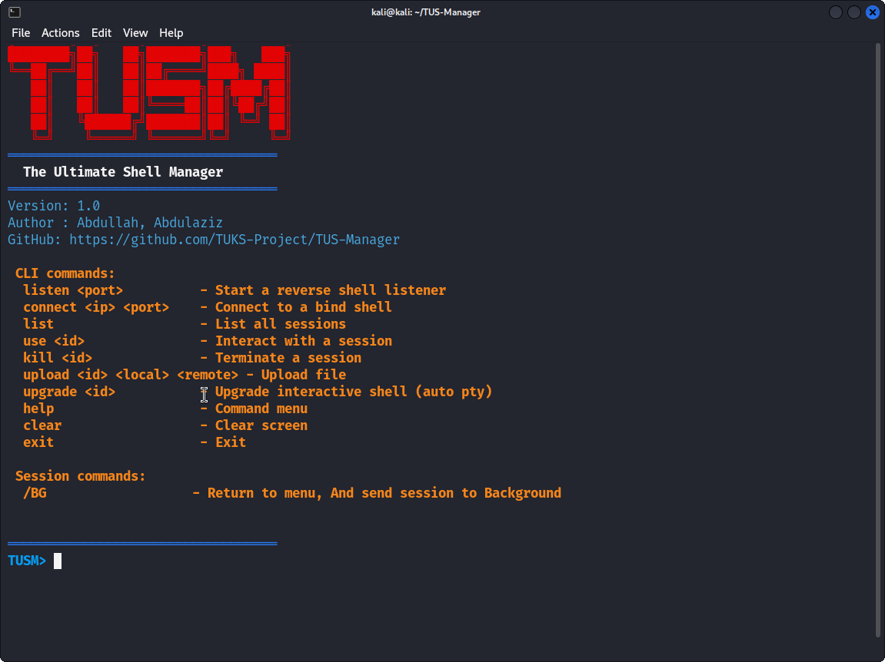

# TUS-Manager — The Ultimate Shell Manager

> A compact and practical shell session manager for penetration testers.

## Overview

TUS-Manager (TUSM) is a C-based shell management utility that helps penetration testers and red-teamers manage bind and reverse shell sessions created with **netcat (nc)**. It supports multiple concurrent sessions, interactive switching, file transfers, and shell upgrades.

⚠️ **Important:** This tool is intended for authorized security testing or lab environments only. Do not use it against systems you do not own or without explicit permission.


## Features

- Start listeners to catch reverse shells (`nc -lnp` under the hood)
- Connect to remote bind shells (`nc host port`)
- Manage multiple concurrent sessions
- Interactive session handling (background, switch, terminate)
- Upload and download files via Base64
- Upgrade remote shells to interactive PTYs (python, script, bash)
- Simple CLI with helpful command menu


## Requirements

- GCC (for compilation)
- `nc` (netcat) — traditional or OpenBSD netcat
- `rlwrap` — optional but automatically used for readline support if installed
- POSIX shell environment (Linux/Unix)


---

## Installation


# Clone the repository
```bash
git clone https://github.com/TUKS-Project/TUS-Manager.git
cd TUS-Manager
```


# Compile
```bash
make
```

--- 

## Usage

# Start the tool
```bash
Tusm
```
# User Interface & Commands



## License This project is licensed under the [MIT License](LICENSE). 

